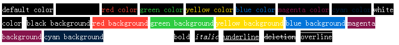

# react-shell-color

Javascript parse [ANSI escape code](https://en.wikipedia.org/wiki/ANSI_escape_code) and render in React, Recode with typescript



# Install

```sh
npm install --save react-shell-color
```

# Component

Common parameters

```tsx
import React from 'react';
import ReactShellColor from 'react-shell-color';

export default () => <ReactShellColor text="\x1b[30m black\n\x1b[m\x1b[31m red\nend" />;
```

# React Hooks

```tsx
import { useShellColor } from 'react-shell-color';

export default function ReactShellColor(props: { text: string }) {
  const { tags, shellColor } = useShellColor(props.text);
  return <>{tags}</>;
}
```

# Shell Color Usage For DOM

```ts
import {SGRStyle} from "react-shell-color";

sc.on('snippet', function (tag: React.Node, text: string, style: SGRStyle) {
  cosnt domTag = document.createElement('span');
  domTag.style = Object.assign(style, domTag.style);
  domTag.innerText = text;
  document.body.appendChild(domTag)
})

```

# Other Usage:

- https://github.com/valaxy/shell-color/

# ChangeLog

- 1.0.0 init project
